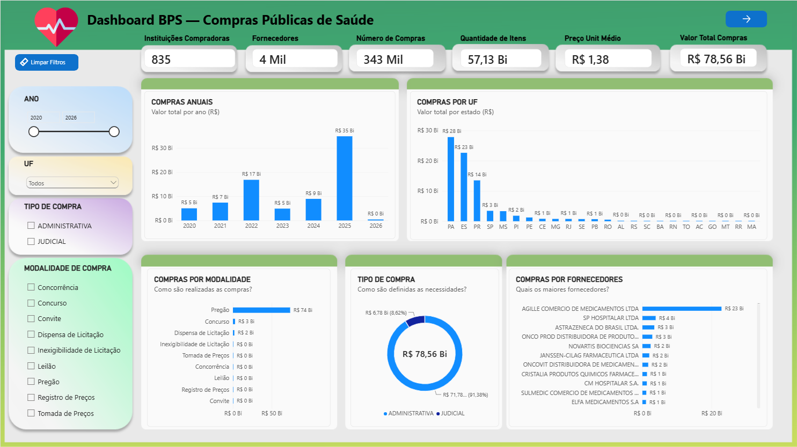
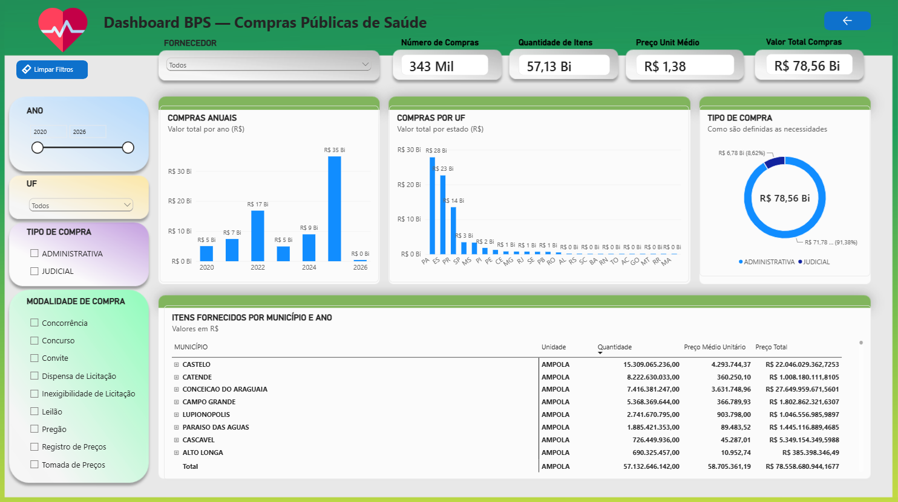

# Mini-Projeto Avaliativo: Dashboard Banco de Preços em Saúde (BPS)

Este repositório documenta o desenvolvimento do Mini-Projeto Avaliativo do Módulo 2, focado na criação de uma solução de Business Intelligence (BI) para análise de compras públicas de medicamentos e dispositivos médicos.

## 1. Objetivo do projeto

Desenvolver um dashboard analítico para acompanhar e explorar as compras registradas no Banco de Preços em Saúde (BPS) entre os anos de 2020 e 2026. O objetivo é transformar grandes volumes de dados públicos em informações estratégicas por meio de KPIs, métricas e visuais interativos, permitindo identificar tendências temporais, avaliar a distribuição geográfica das compras e investigar variações de preços unitários para apoiar a gestão eficiente de recursos públicos na saúde.

## 2. Contextualização do problema

A aquisição de medicamentos e materiais hospitalares por órgãos governamentais envolve um alto volume financeiro, múltiplas modalidades de compra e diversos fornecedores. A gestão desses recursos é um desafio constante. Nesse cenário, a análise de dados surge como uma ferramenta essencial para identificar variações relevantes de preços, mapear a distribuição de compras entre estados e municípios e compreender as tendências ao longo do tempo.

É importante ressaltar que diferenças nos preços unitários não implicam, por si só, irregularidades ou sobrepreço; essas variações podem estar atreladas a fatores como fabricante, apresentação do produto, quantidade adquirida, modalidade de compra e período. Portanto, o problema investigado consiste em fornecer transparência e clareza a esse volume de dados, permitindo ao gestor público formular perguntas de negócio e tomar decisões fundamentadas.

## 3. Arquitetura de Dados

O projeto adota a **Arquitetura Medalhão**, organizando o fluxo de dados em três camadas para garantir a qualidade, integridade e performance das análises:

- **Camada Bronze (Raw):** Dados brutos extraídos e consolidados. Foco em ingestão e rastreabilidade.
- **Camada Prata (Trusted):** Dados limpos, padronizados e enriquecidos. Foco em qualidade e consistência.
- **Camada Ouro (Refined):** Dados modelados em *Star Schema* (Fatos e Dimensões). Foco em performance de BI e consumo analítico.

## 4. Fonte dos dados

Os dados utilizados neste projeto são públicos e foram extraídos do Portal Brasileiro de Dados Abertos do Ministério da Saúde, especificamente do **Banco de Preços em Saúde (BPS)**.

- **Link do Dataset Principal:** [https://dadosabertos.saude.gov.br/dataset/bps](https://dadosabertos.saude.gov.br/dataset/bps)
- **Dicionário de Dados Oficial:** [Dicionário de Dados do BPS](https://dadosabertos.saude.gov.br/dataset/bps/resource/0e76f527-5e7e-417d-9d0b-f46d00afb717)

A base reúne informações de compras públicas e privadas, com a finalidade de subsidiar negociações e compras mais eficientes no setor de saúde.

## 5. Camada Bronze: Procedimentos para baixar e concatenar as bases anuais

O processo de preparação e consolidação dos dados históricos seguiu as seguintes etapas técnicas:

1. **Aquisição dos dados:** Download manual dos arquivos `.csv` referentes aos anos de 2020, 2021, 2022, 2023, 2024, 2025 e 2026 diretamente do portal de dados abertos. Os dados estão disponíveis publicamente no Banco de Preços em Saúde (BPF) mantido pelo Ministério da Saúde.
2. **Inspeção estrutural:** Verificação inicial dos arquivos anuais para mapear discrepâncias de *encoding*, separadores de colunas, nomes de variáveis e tipos de dados entre os diferentes anos. **Não foram identificadas diferenças de colunas entre os anos**.
3. **Importação e Padronização:** Leitura individual dos arquivos `.csv` e agragação em um único arquivo por meio de script Python em um notebook `consolidacao_dados.ipynb`.
4. **Concatenação (*Append*):** Junção vertical das bases anuais em uma única estrutura tabular unificada, garantindo o alinhamento correto das colunas.
5. **Rastreabilidade:** Manutenção de uma coluna identificadora do ano da compra (ou derivação da data) para permitir filtragens temporais futuras.
6. **Exportação:** Geração e salvamento do arquivo consolidado final com o nome `BPS_20_26_OrlandoCastro.csv`.

## 6. Camada Prata: Tratamentos e transformações realizadas nos dados

Após a junção dos arquivos de dados anuais em um único `.csv`, foi criado o notebook `analise_preliminar.ipynb` que realiza a análise preliminar e o tratamento dos dados, garantindo a integridade e consistência das informações antes de prosseguir com análises mais aprofundadas.

Este notebook utiliza como arquivo de entrada os dados em `BPS_20_26_OrlandoCastro.csv` e tem como resultado o arquivo de saída: `BPS_20_26_OrlandoCastro_atualizado.csv`.

Todas as etapas da preparação do arquivo de dados se encontram detalhadamente documentadas no notebook `analise_preliminar.ipynb`. 

As principais verificações incluem:

1. **Verificação de duplicidade de registros:** Foram identificados e removidos registros duplicados, garantindo que cada compra seja representada apenas uma vez no arquivo consolidado.
2. **Verificação de consistência de tipos de dados:** Foram verificadas as colunas do arquivo consolidado para garantir que os tipos de dados estejam corretos e consistentes com as definições originais dos arquivos CSV. Isso inclui a verificação de campos numéricos, datas e strings, garantindo que os dados estejam formatados corretamente para análise.
3. **Verificação de valores nulos:** Foram realizadas verificações adicionais para identificar e tratar valores nulos em colunas críticas, garantindo que os dados estejam completos e consistentes para análise. Isso inclui a verificação de campos obrigatórios, como `compra`, `descricao_catmat` e `cnpj_instituicao`, garantindo que não haja registros com informações ausentes que possam comprometer a análise.

## 7. Camada Ouro: Modelagem de Dados

A etapa final consiste na modelagem dos dados tratados para um esquema estrela (*star schema*), estruturando-os em tabelas-fato e tabelas-dimensões. Esse processo otimiza o tamanho do dataset e permite a criação de métricas complexas para o dashboard. Os detalhes desta modelagem estão documentados no notebook `modelagem_dados.ipynb` e no README da pasta `dados_gold/`.

Como resultado final temos as tabelas em `.CSV` do esquema estrela. A tabela `fato_BPS_20_2026` foi gerada através de JOINs entre a tabela bruta e as dimensões. Ela armazena as métricas quantitativas e as chaves estrangeiras que ligam os fatos às suas respectivas dimensões.

Foram criadas tabelas específicas para cada entidade, onde cada registro único recebeu um identificador numérico (chave primária):

- **Dim_instituicoes**: Cadastro de órgãos compradores (`cod_instituicao`).
- **Dim_municipios**: Localidades das compras (`cod_municipio`).
- **Dim_materiais**: Catálogo de itens, indexado pelo `codigo_br`.
- **Dim_fornecedor**: Cadastro de empresas fornecedoras (`cod_fornecedor`).
- **Dim_fabricante**: Cadastro de fabricantes (`cod_fabricante`).
- **Dim_modalidade_compra**: Tipos de modalidade de licitação (`cod_modalidade`).
- **Dim_tipo_compra**: Tipos de compra (`cod_tipo`).

Os arquivos CSV gerados pelo notebook foram compactados em um arquivo ZIP `dados_gold.zip` por questões de limitação no tamanho de upload de arquivos no GitHub e praticidade de download

## 8. Descrição das principais colunas utilizadas

O modelo dimensional utilizado no dashboard é composto pela tabela fato `Fato_BPS_20_2026` e por sete tabelas de dimensão, conectadas por chaves substitutas (surrogate keys) geradas durante a etapa de modelagem (`modelagem_dados.ipynb`). As principais colunas de cada tabela são descritas a seguir.

### Tabela Fato: `Fato_BPS_20_2026`

Armazena as métricas quantitativas de cada registro de compra e as chaves estrangeiras que a ligam às dimensões.

| Coluna                                                                                                            | Descrição                                                                                                                                                     |
| ----------------------------------------------------------------------------------------------------------------- | ------------------------------------------------------------------------------------------------------------------------------------------------------------- |
| `cod_compra`                                                                                                      | Identificador único do registro de compra (chave primária da tabela fato).                                                                                    |
| `ano_compra`                                                                                                      | Ano em que a compra foi registrada (2020 a 2026). Utilizado como atributo descritivo, não deve ser somado.                                                    |
| `data_compra`                                                                                                     | Data completa da compra, derivada da coluna original `compra`.                                                                                                |
| `cod_instituicao`, `cod_municipio`, `codigo_br`, `cod_fornecedor`, `cod_fabricante`, `cod_modalidade`, `cod_tipo` | Chaves estrangeiras que relacionam a compra às respectivas dimensões (instituição, município, material, fornecedor, fabricante, modalidade e tipo de compra). |
| `unidade_fornecimento`                                                                                            | Unidade em que o item é fornecido (ex.: caixa, ampola, comprimido).                                                                                           |
| `capacidade` e `unidade_medida`                                                                                   | Quantidade e unidade de medida associadas à apresentação do item (ex.: 10 ML).                                                                                |
| `unidade_fornecimento_capacidade`                                                                                 | Descrição combinada da unidade de fornecimento com sua capacidade.                                                                                            |
| `qtd_itens_comprados`                                                                                             | Quantidade de itens adquiridos no registro de compra.                                                                                                         |
| `preco_unitario`                                                                                                  | Valor unitário pago pelo item, conforme registrado na base original.                                                                                          |
| `preco_total`                                                                                                     | Valor total da compra (quantidade × preço unitário), principal métrica financeira do dashboard.                                                               |

### Tabelas de Dimensão

| Tabela                  | Colunas principais                                                  | Finalidade                                                                                     |
| ----------------------- | ------------------------------------------------------------------- | ---------------------------------------------------------------------------------------------- |
| `Dim_instituicoes`      | `cod_instituicao`, `nome_instituicao`, `esfera`, `cnpj_instituicao` | Identifica o órgão comprador e sua esfera administrativa (municipal, estadual ou federal).     |
| `Dim_municipios`        | `cod_municipio`, `municipio_instituicao`, `uf`                      | Localiza geograficamente a instituição compradora, permitindo análises por estado e município. |
| `Dim_materiais`         | `codigo_br`, `descricao_catmat`                                     | Catálogo dos medicamentos e dispositivos médicos adquiridos, indexado pelo código CATMAT/BR.   |
| `Dim_fornecedor`        | `cod_fornecedor`, `cnpj_fornecedor`, `fornecedor`                   | Cadastro das empresas responsáveis pela venda/distribuição do item.                            |
| `Dim_fabricante`        | `cod_fabricante`, `cnpj_fabricante`, `fabricante`                   | Cadastro dos fabricantes responsáveis pela produção do item.                                   |
| `Dim_modalidade_compra` | `cod_modalidade`, `modalidade_compra`                               | Modalidade de licitação utilizada (ex.: Pregão, Concorrência, Dispensa de Licitação).          |
| `Dim_tipo_compra`       | `cod_tipo`, `tipo_compra`                                           | Classifica a natureza da compra (ex.: Administrativa, Judicial).                               |

Colunas com alto índice de valores nulos na base original (`generico` e `anvisa`, ambas com cerca de 50% de ausência) foram removidas na Camada Prata e não constam no modelo final, conforme documentado no notebook `analise_preliminar.ipynb`.

## 9. Definição dos KPIs e das métricas

Os indicadores do dashboard foram implementados como medidas DAX na tabela `Medidas_BPS`, criada especificamente para centralizar os cálculos e manter o modelo organizado. Todas as medidas utilizam a função `DIVIDE()` em vez do operador `/` para evitar erros de divisão por zero quando os filtros aplicados resultarem em denominador nulo.

| KPI                          | Medida DAX                                                      | Interpretação                                                                                                                                                                                                                                                                                                                                                                                                        |
| ---------------------------- | --------------------------------------------------------------- | -------------------------------------------------------------------------------------------------------------------------------------------------------------------------------------------------------------------------------------------------------------------------------------------------------------------------------------------------------------------------------------------------------------------- |
| **Valor Total Compras**      | `SUM(Fato_BPS_20_2026[preco_total])`                            | Soma do valor financeiro de todas as compras que atendem aos filtros selecionados. Principal indicador de volume financeiro.                                                                                                                                                                                                                                                                                         |
| **Quantidade de Itens**      | `SUM(Fato_BPS_20_2026[qtd_itens_comprados])`                    | Soma das unidades adquiridas nos registros filtrados.                                                                                                                                                                                                                                                                                                                                                                |
| **Número de Compras**        | `COUNTROWS(Fato_BPS_20_2026)`                                   | Contagem de linhas (registros de compra) presentes na base após a aplicação dos filtros.                                                                                                                                                                                                                                                                                                                             |
| **Instituições Compradoras** | `DISTINCTCOUNT(Fato_BPS_20_2026[cod_instituicao])`              | Contagem distinta de órgãos compradores, evitando duplicidade quando uma instituição realiza múltiplas compras.                                                                                                                                                                                                                                                                                                      |
| **Fornecedores**             | `DISTINCTCOUNT(Fato_BPS_20_2026[cod_fornecedor])`               | Contagem distinta de fornecedores presentes nos registros filtrados.                                                                                                                                                                                                                                                                                                                                                 |
| **Preço Unitário Médio**     | `DIVIDE([Valor Total Registrado], [Quantidade Total de Itens])` | Razão entre o valor total e a quantidade total de itens. Foi adotada a média ponderada, e não a média aritmética simples de `preco_unitario`, pois compras com quantidades muito distintas não podem ter o mesmo peso na análise. Esse indicador deve ser interpretado com cautela quando os filtros combinarem produtos, unidades de fornecimento ou apresentações diferentes, já que perde comparabilidade direta. |

### Critérios de agregação

- **Soma (`SUM`)** foi utilizada para `preco_total` e `qtd_itens_comprados`, pois representam volumes cumulativos que fazem sentido ao serem somados.
- **Contagem distinta (`DISTINCTCOUNT`)** foi aplicada às chaves de instituição e fornecedor, para responder "quantas entidades únicas" em vez de "quantos registros".
- **Divisão ponderada (`DIVIDE`)** substituiu a média simples no cálculo de preço unitário, evitando distorções que ocorreriam ao tratar igualmente uma compra de 10 unidades e outra de 100.000 unidades.
- Evitou-se deliberadamente somar a coluna `preco_unitario` diretamente, pois essa operação não representa nenhuma informação de negócio válida (a soma de preços unitários de produtos distintos não tem significado interpretável).

## 10. Link ou imagens do dashboard

O dashboard foi desenvolvido no **Power BI Desktop**, como alternativa ao Looker Studio (Google Data Studio), devido a limitações encontradas no upload da base de dados consolidada na ferramenta do Google. Essa substituição está prevista no próprio enunciado do mini-projeto como opção válida.

- **Arquivo do dashboard:** `Dashboard_BPS.pbix` 
- **Capturas de tela:** as imagens do painel principal estão disponíveis na pasta `imagens/` deste repositório .

<div>
<p align="center">
  
</p>
</div>

O painel principal reúne seis cartões de KPI no topo (Instituições Compradoras, Fornecedores, Número de Compras, Quantidade de Itens, Preço Unitário Médio Ponderado e Valor Total de Compras), filtros interativos por Ano, UF, Tipo de Compra e Modalidade de Compra na lateral esquerda, e cinco visuais analíticos: evolução anual do valor de compras, valor total por UF, distribuição por modalidade de compra, proporção por tipo de compra e ranking dos principais fornecedores.

O segundo painel apresenta métricas e gráficos relacionados aos fornecedores.

<div>
<p align="center">
  
</p>
</div>

## 11. Principais análises e descobertas

- **Concentração temporal recente:** o volume financeiro de compras cresceu de forma acentuada nos anos mais recentes do período analisado, com destaque para um salto expressivo no último ano do intervalo em relação aos anos anteriores, sugerindo aumento da demanda ou da granularidade de registro na base.
- **Concentração geográfica:** um pequeno grupo de estados concentra a maior parte do valor total de compras, enquanto a maioria das UFs apresenta participação residual. 
- **Modalidade de compra predominante:** a maior parte do valor financeiro é executada por meio de Pregão, modalidade tipicamente usada para aquisições de menor complexidade técnica, enquanto modalidades como Concurso, Convite e Leilão têm participação marginal.
- **Predomínio de compras administrativas:** a grande maioria do valor total corresponde a compras de natureza administrativa, com uma parcela bem menor vinculada a determinações judiciais, o que é coerente com o funcionamento ordinário do sistema de saúde pública frente a demandas excepcionais.
- **Preço unitário médio ponderado como indicador de referência:** o valor calculado (`Valor Total Registrado / Quantidade Total de Itens`) serve como parâmetro inicial de comparação, mas variações relevantes entre instituições, fornecedores e períodos foram observadas e devem ser investigadas caso a caso, sempre considerando fatores como apresentação do produto e volume da compra.

## 12. Recomendações baseadas nos dados

- **Negociação centralizada com grandes fornecedores:** dada a concentração de valor em poucos fornecedores, órgãos compradores de menor porte poderiam se beneficiar de compras consorciadas ou adesão a atas de registro de preços já negociadas por entes de maior volume, buscando condições mais vantajosas.
- **Monitoramento de variações de preço unitário:** recomenda-se acompanhar periodicamente o preço unitário médio ponderado por item (CATMAT) e por UF, criando alertas para desvios relevantes em relação à média histórica, sempre validando o contexto (fabricante, apresentação, quantidade) antes de caracterizar qualquer variação como anômala.
- **Aprofundamento da análise por categoria terapêutica:** recomenda-se, em trabalhos futuros, cruzar os dados do BPS com classificações terapêuticas (ex.: ATC) para identificar se a concentração de fornecedores varia entre diferentes classes de medicamentos.

## 13. Limitações identificadas na base ou na análise

- **Ausência de padronização de causalidade nas variações de preço:** conforme alertado no próprio enunciado do desafio, diferenças de preço unitário não podem ser interpretadas automaticamente como sobrepreço ou irregularidade, pois fatores como fabricante, apresentação, unidade de fornecimento e modalidade de compra influenciam diretamente o valor, sem que a base permita isolar completamente cada uma dessas variáveis.
- **Remoção de colunas com alta incidência de nulos:** as colunas `generico` e `anvisa` foram excluídas do modelo final por apresentarem aproximadamente 50% de valores ausentes, o que impede análises relacionadas à natureza genérica dos medicamentos ou ao registro na ANVISA.
- **Enriquecimento parcial via API externa:** a recuperação de nomes de instituições ausentes via API do OpenCNPJ.org dependeu da disponibilidade e atualização da base de terceiros, podendo não cobrir 100% dos casos nulos originais caso o CNPJ consultado não estivesse cadastrado na fonte externa.
- **Dados de 2026 parciais:** por se tratar do ano corrente, o volume de registros de 2026 é naturalmente incompleto em comparação aos anos anteriores, o que pode distorcer comparações diretas de totais anuais se não for considerado esse recorte temporal parcial.
- **Preço unitário médio ponderado sensível ao mix de produtos:** ao aplicar filtros que combinem produtos, apresentações ou unidades de fornecimento distintas, esse indicador perde parte de sua comparabilidade, exigindo cautela na leitura quando a segmentação for muito ampla.

## 14. Instruções para reprodução do projeto

Para reproduzir integralmente o pipeline de dados e o dashboard deste projeto, siga as etapas abaixo na ordem apresentada.

### Pré-requisitos

- Python 3.12 ou superior, com as bibliotecas `pandas`, `duckdb` e `requests` instaladas (`pip install pandas duckdb requests`).
- Jupyter Notebook ou Google Collab para execução dos notebooks `.ipynb`.
- Power BI Desktop (versão mais recente) para abertura e edição do dashboard.
- Conexão à internet, apenas na etapa de enriquecimento de dados (consulta à API do OpenCNPJ.org).

### Passo a passo

1. **Clonar o repositório:**
   
   ```
   git clone https://github.com/orlandovcj/SCTEC-Visualizacao-de-Dados-Miniprojeto.git
   ```

2. **Camada Bronze:** extrair os arquivos `.zip` da pasta `dados_bronze/` (um por ano, de 2020 a 2026) e executar o notebook `consolidacao_dados.ipynb`. Ele lerá todos os `.csv` da pasta e gerará o arquivo `BPS_20_26_OrlandoCastro.csv`.

3. **Camada Silver:** executar o notebook `analise_preliminar.ipynb`, utilizando como entrada o arquivo gerado no passo anterior. Este notebook realiza a limpeza, padronização e enriquecimento dos dados, produzindo `BPS_20_26_OrlandoCastro_atualizado.csv`.

4. **Camada Gold:** executar o notebook `modelagem_dados.ipynb`, que utiliza o DuckDB para transformar a base tratada em um esquema estrela, gerando a tabela fato e as sete tabelas de dimensão em formato `.csv` (compactadas em `dados_gold.zip`).

5. **Construção do dashboard:** abrir o Power BI Desktop e importar os oito arquivos `.csv` gerados na etapa anterior (Obter Dados → Texto/CSV). Configurar os relacionamentos entre a tabela fato e as dimensões pelas respectivas chaves, conforme descrito no item 8 deste README.

6. **Criação das medidas:** criar a tabela `Medidas_BPS` e inserir as fórmulas DAX descritas no item 9 deste README.

7. **Abrir o dashboard finalizado:** o arquivo `.pbix` publicado neste repositório já contém o modelo e as medidas configuradas, podendo ser aberto diretamente no Power BI Desktop.

### Observações

- Os arquivos de dados intermediários e finais estão disponíveis em formato `.zip` nas pastas `dados_bronze/`, `dados_silver/` e `dados_gold/` devido a limitações de tamanho de upload do GitHub.
- Caso a API do OpenCNPJ.org esteja indisponível no momento da execução, o notebook `analise_preliminar.ipynb` pode ser ajustado para utilizar outra API disponível.
